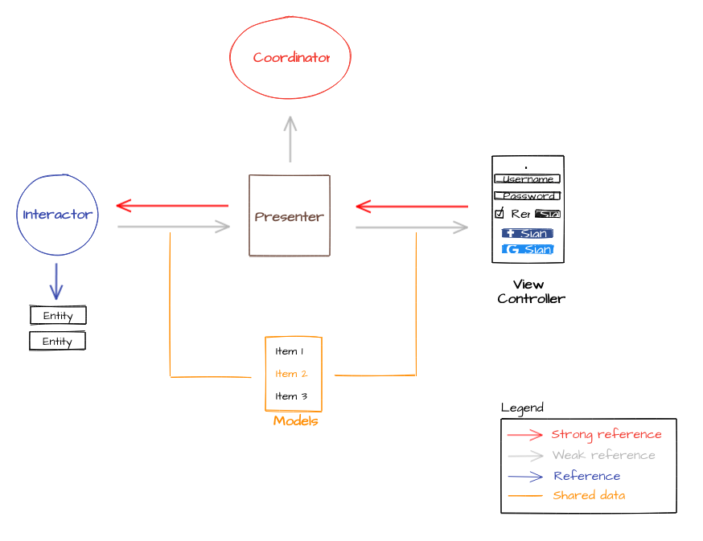

## 📖 Project architecture

Most of Nodes applications are architected using 🐍 Viper Architecture.
Architecture templates can be [found here](https://github.com/nodes-ios/VIPERCoordinatorsXcodeFileTemplate)


### Project structure

The project consists in a 5 layer architecture.

- Coordinator:
	- Contains the navigation logic flow and holds the reference of the views to present.
	- Also creates the whole scene and injects the dependencies.
- Interactor:
	- Where all the business logic goes specific by each use case.
- Presenter:
	- It's a bridge between the Interactor(s) and the View Controller. 
	- Its responsibility is to prepare the data for display.
- ViewController:
	- Displays the content and handles the UI events to the presenter.
- Models:
	- Provides the model for the interactor.
	- It's used to share the data between the layers.


Each layer has it's own accessor from outside. We call it `input` and `output`.

To interact with `input's` and `output's` we use protocols. It means that the objects will be restricted to the actions described in the protocols bringing more reliability and type safety to our project.

--

**The coordinator** (or Router) is responsible to instantiate and initilize the views during the app lifecycle when needed.
One coordinator takes care of one or more scenes. It means that we don't have to create one coordinator for each scene.
We can have one coordinator taking care of the same group of views.

Eg.: Profile create, profile edit and profile display.

--

**Interactor** holds the business logic for a specific data model. It has the connection with the Models to manipulate the data and it should be totaly independent from the UI.

One of it's responsibilities is to make the API call's and parse the received data to the models.
When building Interactors we create one Interactor per data model. For example each application that has an User object will have a single UserInteractor. 
All the data is provided trough the input's and output's.

--

**Presenter** is responsible to handle the view interactions and drive the UI. It receives all the user actions on the UI and drives the app to the correct path. It's also their responsibility to make the calls for the other layers in order to get the data or to navigate to another flow. It also has its accessors defined by the input and output protocols.

One Presenter can have multiple Interactors.

--

**View Controller** manages the interface for the user. The view never asks the presenter for data. It's passive and waits until the presenter gives the data back to be presented in the view. All the events should be send to the presenter. When the data is ready, the presenter will invoke the output method from the view controller with the result of the request.

--

**Models** It's not just data structures. We use the models to share the data between the different layers of the scene.

Eg.: The interactor makes a API call and receives the json file. The data will be parsed and stored in memory in the models and it can be accessed on presenter layer.


## Flow control



## Protocols

In order to notify the objects through the app, we use protocols.
Be careful when defining your protocols to avoid retain cycles. Make your protocols conform to `class` protocol to its declaration and use `weak` reference when declaring your variables. Keep in mind that not all delegates should be declared as `weak`, you may need some reference to that protocols during the view lifecycle and those objects should not be deallocated. 

Eg.: 

```
protocol MyCoordinatorInput: class { }
weak var coordinator: MyCoordinatorInput?


Example of strong references: 

	ViewController >> PresenterInput
	PresenterInput >> InteractorInput

Example of weak references:

	Presenter >> CoordinatorInput
	Coordinator >> ViewController
```

## Testing

Using Viper architecture, everything is easy to test since it's proposal is based on SRP (Single Responsibility Principle).

For automated tests we suggest you to use Quick and Nimble framework.
