# Monstarlab iOS Bitrise - Setup Guide with Cloud Code Signing ☁️

This is a simple Bitrise app setup guide that makes use of Apple cloud signing. This allows us to simplify the setup tremendously. 

## How does cloud signing work? 
Cloud signing means the code signing files are managed on Apple servers. You do not need to set them up locally or use Fastlane Match. The code signing files are fetched from Apple servers and you just need an Apple dev account with sufficient access rights (Admin or Developer with access to certificates - including cloud certificates).

Cloud code signing makes use of the `xcodebuild` command which is also used internally in the Bitrise archiving step. You need these 3 things to create a code signed .ipa file using this command:
- xarchive of your app - initial archive. Before the proper code signing files are fetched from Apple, this archive is created and signed using a development certificate. Later it is resigned using the proper code signing files. 
- exportOptions.plist - just a plist specifying the configuration options like team id or distribution method. Handled by the Bitrise step.
- App Store Connect API key - to authenticate with Apple and download code signing files. You need to create this and upload it to your profile in Bitrise.

  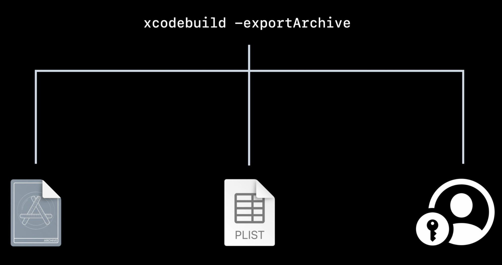

 

Once all of these are passed to the command, the right code signing files are fetched from the Apple servers and used to code sign the app. The resulting .ipa file is then uploaded to App Store Connect in the upload Bitrise step.

More on cloud signing [here](https://developer.apple.com/videos/play/wwdc2021/10204/).

## Features of this setup: 
 - Easy setup in the Bitrise GUI
 - Builds two Xcode configurations: Release and Test
 - Uses App Store Connect API key to code sign and send builds to Testflight
 - Deploys builds to Testflight only
 - Builds triggered by commit tags - `*`, `*_release` and `*_test`
 - Sends a success message to Slack - does not send anything on failure
 - Works with CocoaPods and SPM. Carthage is dead ☠️

## Steps: 
- [1. App Store setup](#App-Store-setup)
- [2. Xcode setup](#Xcode-setup)
- [3. App setup on Bitrise](#App-setup-on-Bitrise)
- [4. Environment vars setup](#Environment-vars-setup)
- [5. Secrets setup](#Secrets-setup)
- [6. Code signing](#Code-signing)
- [7. App Store Connect Authentication](#App-Store-Connect-Authentication)

## App Store setup
Make sure you have all of these set up in App Store:
- 2 apps for both for the release and test environments
- Production certificate and provisioning profiles for all the apps (including the entitlements)

❗️Important❗️
If you migrate from using Fastlane Match, it is probably wise to nuke all the certificates and provisioning profiles and remake them from scratch. Using the old ones can result in getting a *This App Cannot be installed because its integrity could not be verified* error when trying to install the app from TestFlight.

## Xcode setup

Make sure your project's schemes are ***shared (including app extensions)***. 
Enable ***Automatically manage signing*** for all the configurations you want to build in the CI. If you do not do this, you will get failures in the Archive step. 

  

 

## App setup on Bitrise

1) Create a new App from the Bitrise dashboard
- Make sure you choose **Monstarlab** account when creating the new app and make it **Private**

  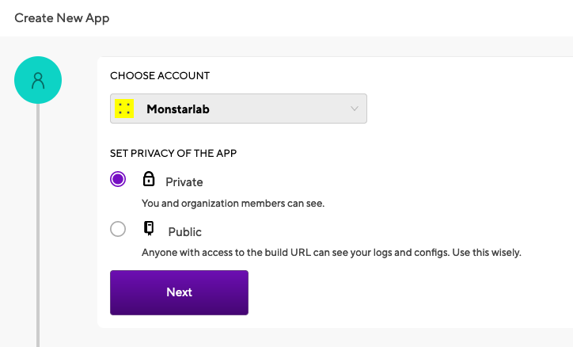

 

2) Connect the repository to Bitrise

  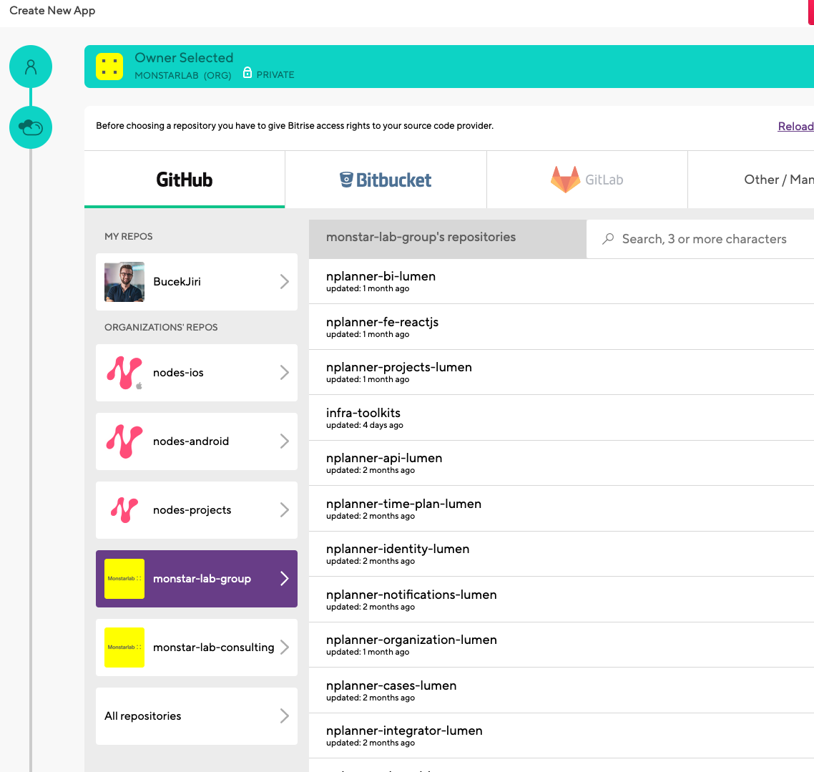

 

3) When setting up the access make sure to add our SSH key using the private key found in the [ci-resources-ios](https://github.com/nodes-projects/ci-resources-ios/blob/master/privatekey) repository.

  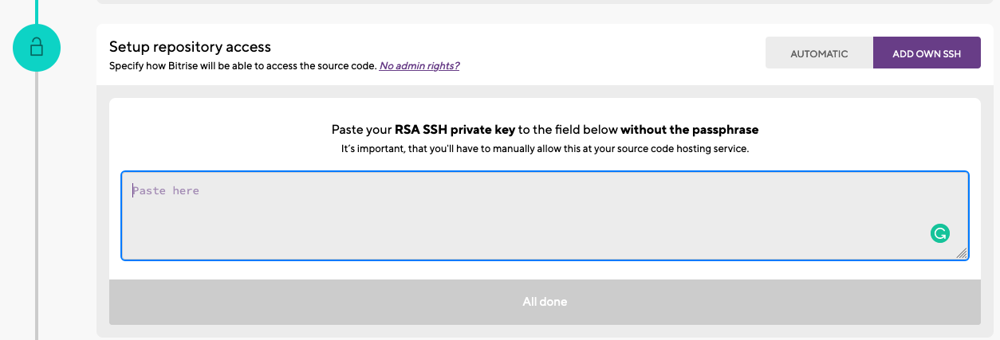

 

4) Indicate which branch Bitrise should use to make the builds. Usually develop. 

5) After choosing the branch, Bitrise will validate the source code and then you can select the *export method* you want to use. Go with ***app store***. Bitrise should also autodetect your project file and scheme.

  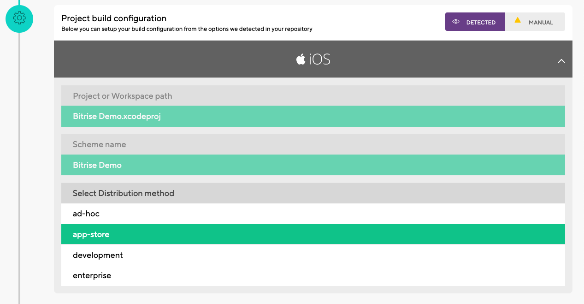

 

6) The last step is the Webhook setup. This is used to trigger the builds by tags. Tap on **Register a webhook for me**. If the automatic registration does not work, you can [setup the webhook manually](https://devcenter.bitrise.io/en/apps/webhooks/adding-incoming-webhooks.html#adding-incoming-webhooks) now or later. You need to have the admin rights for the Github repository of your app for this though. 

  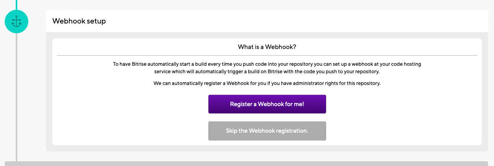

 

## Environment vars setup
In order to make everything work on Bitrise you'll need to copy the template content from [bitrise.yml](https://github.com/nodes-projects/ci-resources-ios/blob/master/bitrise_cloud_signing.yml) into the Bitrise workflow script.

  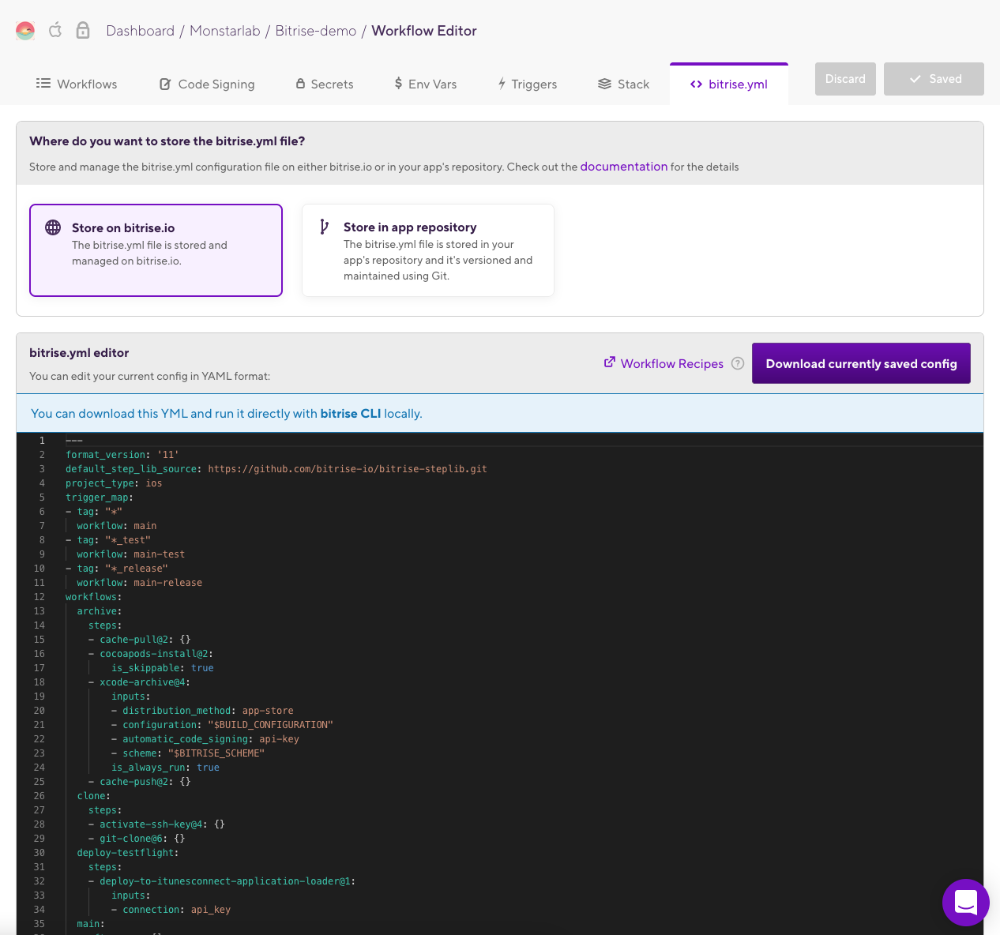

 

Go to **Workflow > Env** Vars tab. 
You should see all your environment variables here.
- SLACK_CHANNEL - name of the Slack channel to send a message when the build succeeds
- RELEASE_BUILD_CONFIGURATION and TEST_BUILD_CONFIGURATION - change only if you have different names in your project.
- BITRISE_PROJECT_PATH and BITRISE_SCHEME - change them from placeholders to your project's values. 

Leave the BUILD_CONFIGURATION empty. This is assigned in the preparation steps during building.

  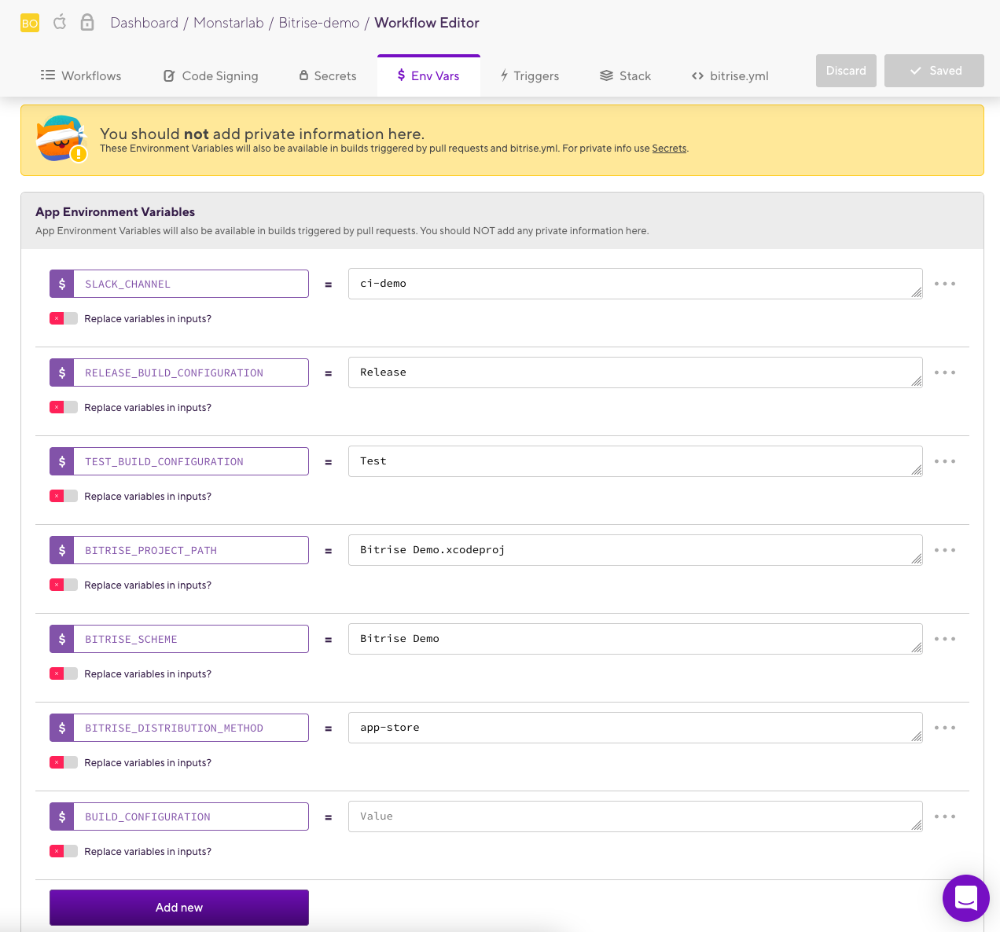

 

## Secrets setup
Go to the **Workflow > Secrets** tab. Add these secrets:
- BUILD_TRIGGER_API_TOKEN - Can be found in the **Code** tab of your app on Bitrise. This is needed to trigger the build workflows.
- SLACK_TOKEN - Used to send notifications after successful builds. The token is universal for the Monstarlab Slack Workspace (I think). Can be found [here](https://github.com/nodes-projects/ci-resources-ios/blob/master/slackToken) or copied from another app on Bitrise. 

  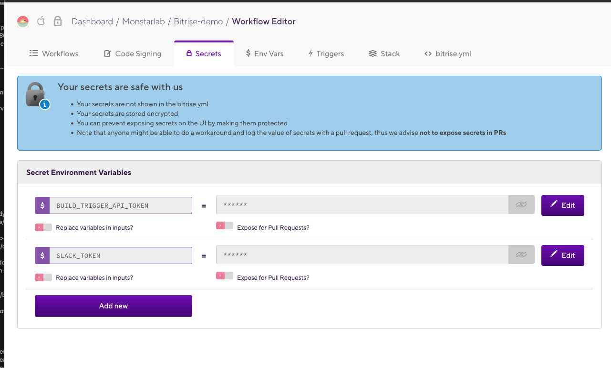

 

  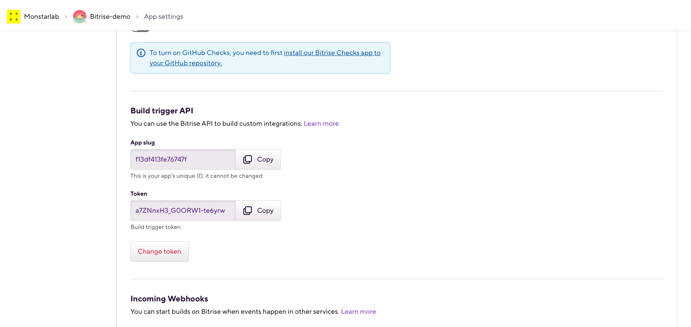

 

## Code signing
You only need to upload the development signing certificate to Bitrise. This is used to code sign an initial archive before the code signing files are downloaded from Apple and the app is resigned with them. Even this development certificate could be omitted theoretically because the cloud code signing can create a new one if it does not find it locally. This, however, creates multiple new development certificates with every new build so it is better to upload it to Bitrise.

1) Download the certificate from the Apple Developer portal.

  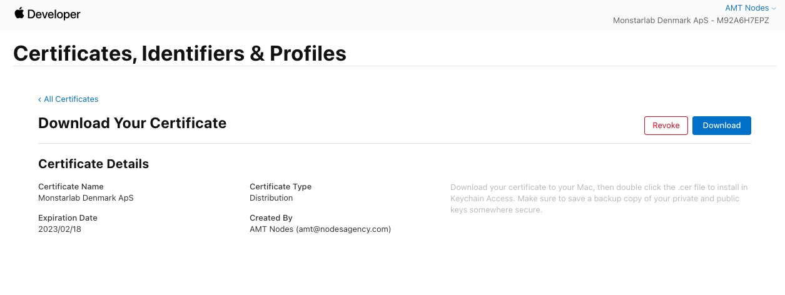

2) The certificate is in a .cer format. You will need the private key .p12 file though that is associated with the .cer file.
3) Double click the certificate and install it into your Keychain.
4) Find the cert in your Keychain. Expand it and right tap on the private key. Select ***Export <Certificate name>***. If you do not see the private key, you downloaded a certificate without it. You can either find the person who created the certificate and get the original certificate from them or you can create a new certificate. The full certificate with the private key can be downloaded from the Apple Developer portal only once.

  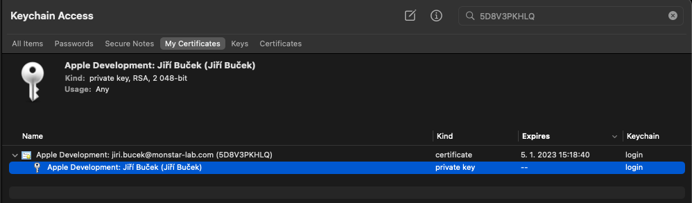

5) Create a password for the exported key. You will need to fill it later into Bitrise.
6) In Bitrise, go to **Workflow > Code signing** and upload the certificate. Fill in the password and make it protected by clicking on the three dots and selecting **Make protected**.

  

  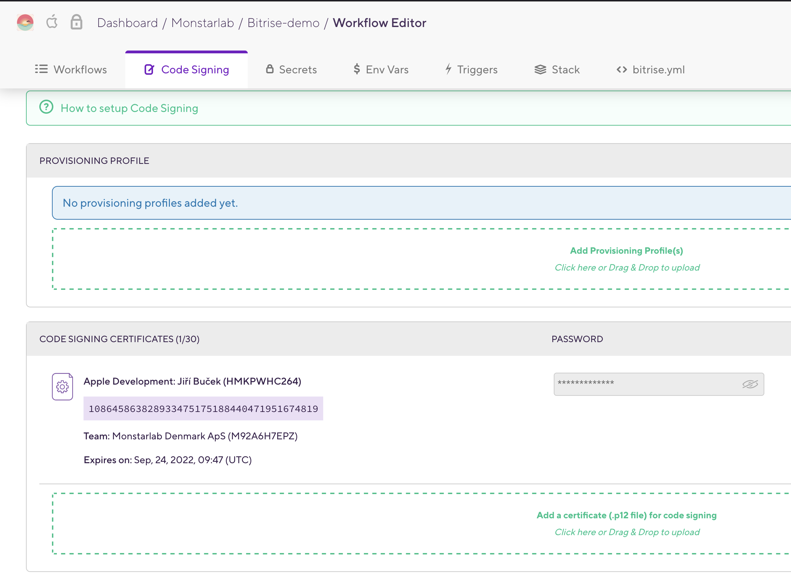

 

## App Store Connect API Authentication
ASC API key is used to authenticate with the ASC to fetch code signing files and send the builds to the App Store. The ASC key configuration is slightly different than the one we used in past. 

In short, you need to create the key in ASC and then upload it to your profile in Bitrise. Once you have it uploaded to your profile, you need to select this connection in your Bitrise app. This is considered your private connection, there is no way to set this up for an entire organization afaik. Once this connection si set in the app, the builds triggered by other members of the team can use it too though.

#### 1. Create the App Store Connect API Key

[Apple documentation.](https://developer.apple.com/documentation/appstoreconnectapi/creating_api_keys_for_app_store_connect_api)

The API key authentication can be allowed only by the Apple Dev Team Account Holder. You will need to contact this person (probably the client) to do it for you. Once this kind of authentication is allowed, the account's admins can create the keys themselves.

To create the API key, go to:
- https://appstoreconnect.apple.com
- Users and Access
- Keys
- App Store Connect API

and create a new API key with Admin privileges. Download and save the key (it is a .p8 file and can be downloaded only once). 
❗️DO NOT CHANGE THE FILE NAME, OTHERWISE IT WILL BREAK THE STEP IN THE CI ❗️. The file format should be AuthKey_XXXXXXXX.p8. 

You will also need the issuer ID and the key ID from this page. When you have downloaded the key, please send it to Martin Majer at Service Desk so that it can be securely stored.

#### 2. Upload the App Store Connect API key to Bitrise
Next you need to upload the obtained .p8 key file to the Monstarlab organization on Bitrise and set this connection in your app's Team tab. The key works universally for all apps in one Apple Dev Team and can be therefore reused for multiple apps from the same Apple Dev Team.

You can find a guide to set the API key connection for the app [here](https://devcenter.bitrise.io/en/accounts/connecting-to-services/connecting-to-an-apple-service-with-api-key.html#adding-api-key-authentication-data-on-bitrise). 

# Tadaaa, you are all done 🎉
Before making a build, also make sure you use the right version of Xcode in the **Stack** tab.
  
Now tag a commit and push the tag to your repo. This should trigger a build.
  
 If you did everything correctly, the build should succeed. No guarantees though, CI can be a b*tch sometimes 😀.

